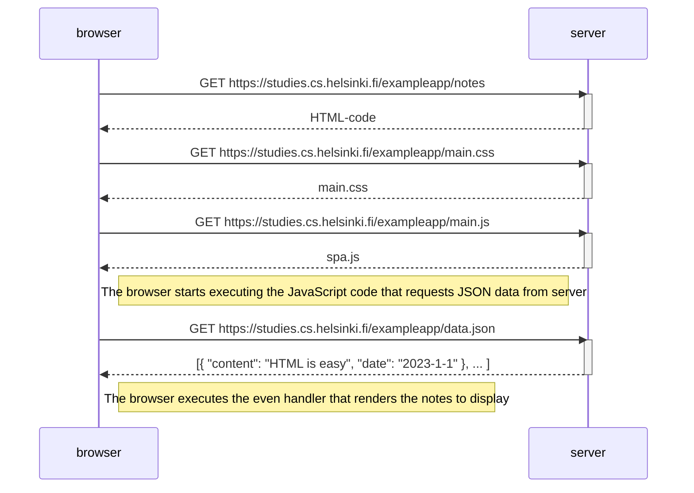

```mermaid
sequenceDiagram
    participant browser
    participant server

    browser->>server: GET https://studies.cs.helsinki.fi/exampleapp/notes
    activate server
    server-->>browser: HTML-code
    deactivate server

    browser->>server: GET https://studies.cs.helsinki.fi/exampleapp/main.css
    activate server
    server-->>browser: main.css
    deactivate server

    browser->>server: GET https://studies.cs.helsinki.fi/exampleapp/main.js
    activate server
    server-->>browser: spa.js
    deactivate server

    Note right of browser: The browser starts executing the JavaScript code that requests JSON data from server

    browser->>server: GET https://studies.cs.helsinki.fi/exampleapp/data.json
    activate server
    server-->>browser: [{ "content": "HTML is easy", "date": "2023-1-1" }, ... ]
    deactivate server

    Note right of browser: The browser executes the even handler that renders the notes to display

```